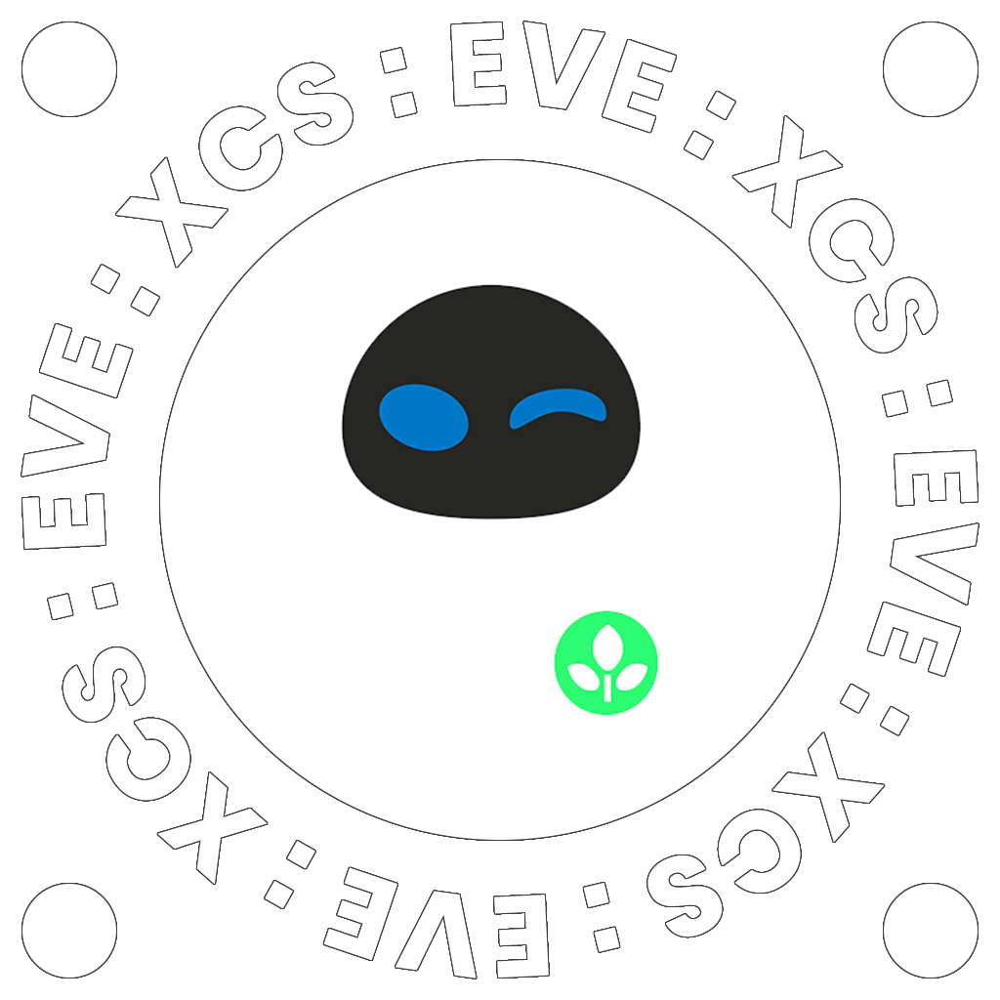

## Description

EVE : XCS is a simple web application for managing entry points.
Communication between the client and the server is done via. JSON over an HTTP API.

## Installing Dependencies

To install dependencies, run the following command:

`npm i`

## Starting the Development Server

This application was built using [create-react-app](https://reactjs.org/docs/create-a-new-react-app.html).

To start the development environment, run the following command:

`npm start`

By default, the development server will be started on port 3000, however, you can specify a different port by passing the `PORT` environment variable in `manifest.json`.

## Building from Source

To build the application from source, run the following command:

`npm run build`

## License

This project is licensed under the MIT license. See the LICENSE file for details.